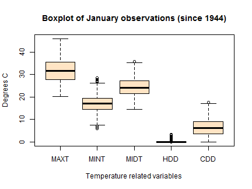

## The need for the app

* As temperature variability is an important driver in many statistical analyses, it should be convenient to have an easy-to-access webpage with the graphical and tabular summaries of the useful data and statistics. Many of those are available from dedicated websites, like the Australian Bureau of Meteorology [website](http://www.bom.gov.au/), but there is no guarantee they will always have exactly what you may need next. 

* One thing they will always have is the raw data they collect to share. The number and complexity of the useful analyses that a team of skilful quantitative analysts can produce is only limited by their available time and imagination. The latest browser supported technologies (HTML5 & CSS3), the latest trends in statistical computing (R & RStudio) and the free websites for individuals' data product projects (github.io & shinyapps.io) all suggest that modern data analyses should be interactive, dynamic and reproducible.   

* To address this need, and as a proof of concept, a Shiny app was developed and deployed at [shinyapps](https://andrekos.shinyapps.io/shinybom). This [Slidify](http://slidify.org/) presentation, written to pitch the app to those interested, is available from [github.io](https://andrekos.github.io/shinybom). The source code for the app and slides is at [github.com](https://github.com/andrekos/shinybom).

--- .class #id 

## Goodbye static graphs from base, lattice and ggplot!

* Those golden standards of analytic graphics shine no more  

 

* You can't see what years the outliers belong to? Boring. If you want this for another station, your analyst would need to modify the code, re-run it and get back to you. Inefficient.

---

## Hello nice stuff with shiny, ggvis and rmarkdown!

* googleVis, ggvis and friends bring interactive plots to R

<!-- ScatterChart generated in R 3.1.1 by googleVis 0.5.6 package -->
<!-- Sun Oct 26 18:53:53 2014 -->

<!-- jsHeader -->

 
<!-- jsChart -->  

 
<!-- divChart -->
  

* The Shiny app developed allows _you_ to select the month of a year and the weather station. It will eventually allow _you_ to do many more things without your analyst touching the code 

--- &radio

## What is the next step in developing this Shiny app?

I am sure you will be able to deductively conclude that the correct answer is ...

1. Extending the app to include BOM weather data other than temperature 

2. _Exploring the Shiny app building ecosystem further_

3. Extending the app by focusing on temperature related analytics

4. Asking an expensive consultant what businesses want the most

5. Creating an interactive version of the Tukey boxplot

6. Asking around for a feedback on what has been done to date

*** .hint 
This app was a simple project completed in a very short time frame.  As one famous mathematician once mentioned, ["Getting a Ph.D. in two years left me woefully ignorant of almost everything in mathematics not connected with my thesis work."](https://www.dartmouth.edu/~chance/Doob/conversation.html)

*** .explanation 
That's right! I have had more than enough motivation to pause on the project and look around for what is possible and how to do it best. Indeed, as one famous poet once wrote, ["A little learning is a dangerous thing"](http://en.wikipedia.org/wiki/An_Essay_on_Criticism).
